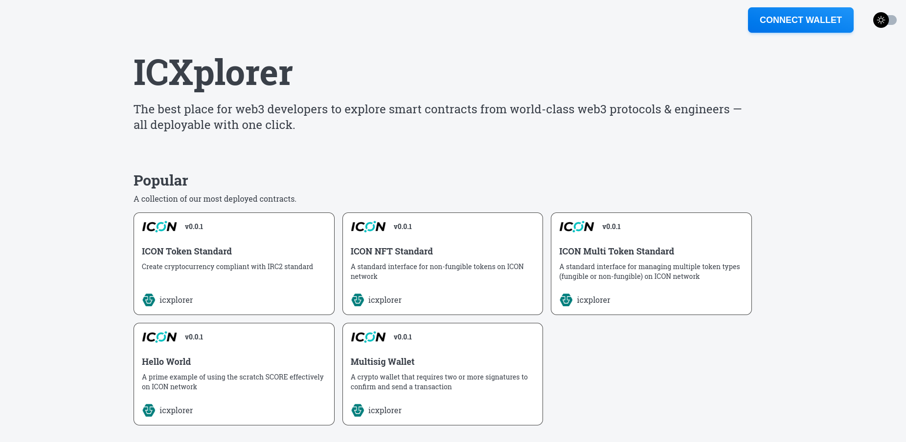
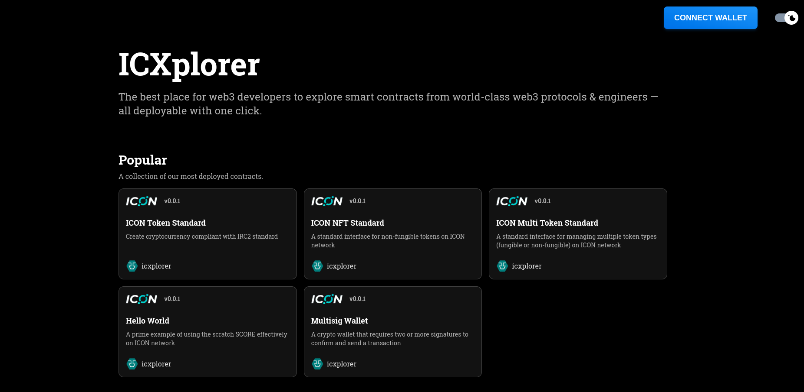
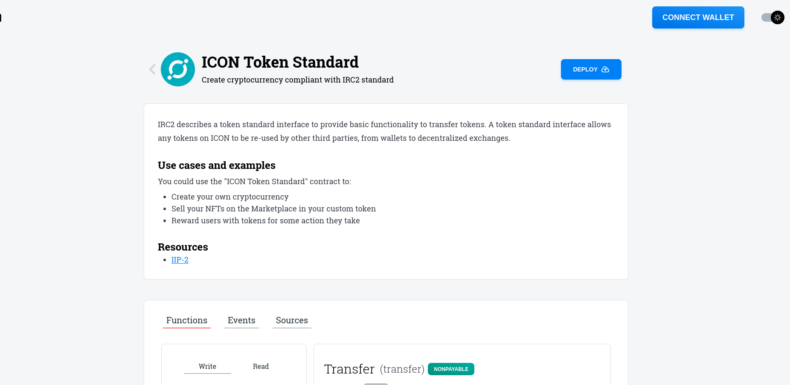
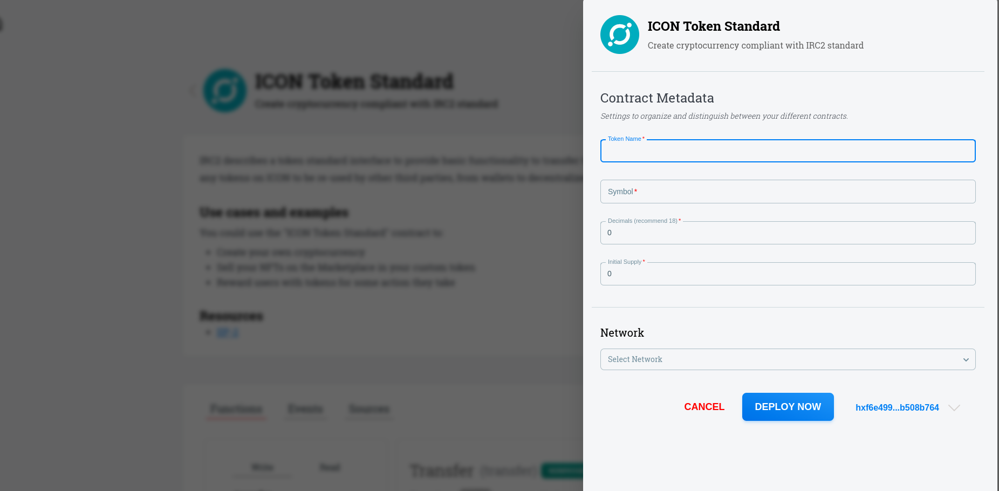
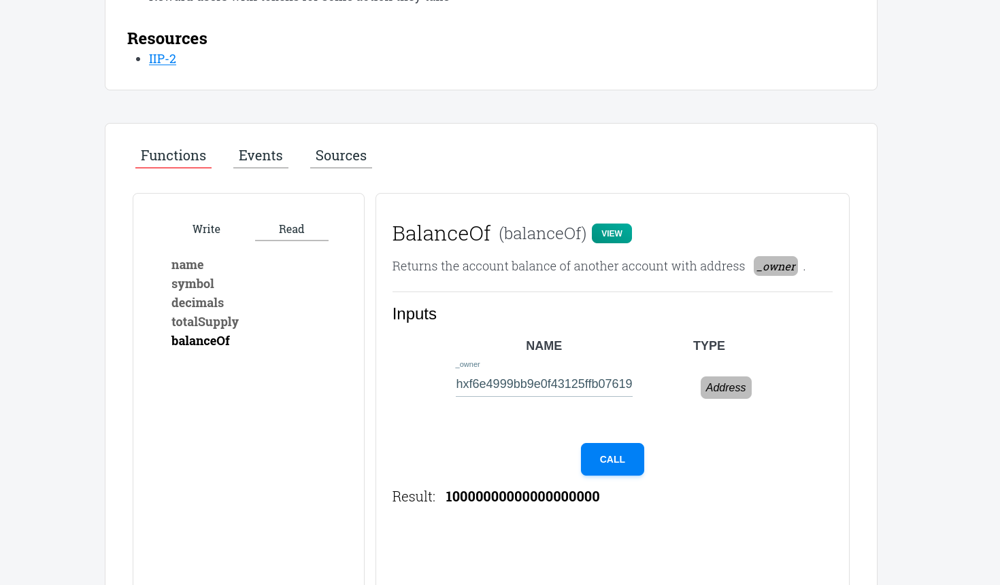
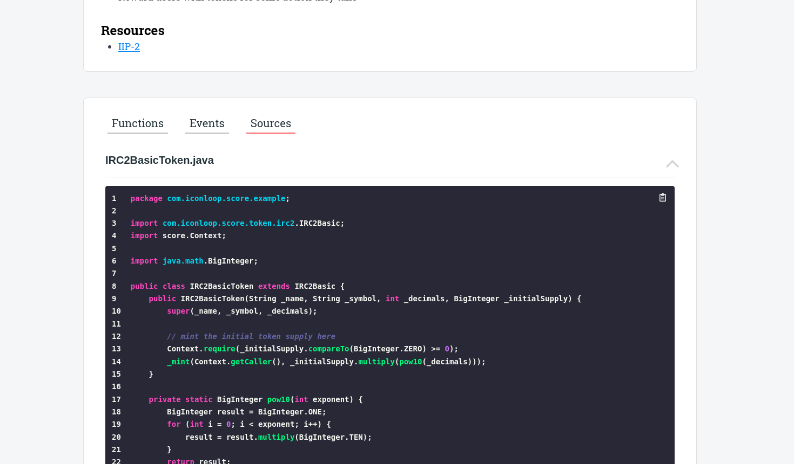

# Xplorer

## Tagline

> The best place for web3 developers to explore smart contracts on ICON blockchain — all deployable with one click.

## Project Story

### Inspiration

I believe that if you have ever developed a smart contract on ICON, you may have found it challenging to deploy a smart contract to the blockchain for the first time. This is because you must install Goloop, compile the source code, configure your wallet, set up the network, and so on. As a result, this can discourage developers from working on the ICON blockchain.

### What it does

With ICXplorer, new developers can easily explore, deploy, and interact with popular smart contracts on ICON for the first time.

### How we built it

- Build UI with Next.js.
- Store smart contract info in MongoDB.
- Use icon-sdk-js to interact with the ICON blockchain.
- Use Hana wallet to connect ICXplorer and deploy a contract they want to explore.

### Challenges we ran into

- Only support smart contracts in `java-score-examples` repository.
- Find other resources providing quality smart contracts on ICON.
- Only support testnet.

### Accomplishments that we're proud of

- New developers on ICON can easily explore and deploy popular smart contracts without complex setup.

### What we learned

- ICON blockchain and how to interact with it.
- How to enhance UX.

### What's next for ICXplorer

- Add more advanced ICON smart contracts.
- Audit smart contracts.
- Support deployment on mainnet.
- Provide sample codes for connecting the front-end to the deployed smart contract.

## Project Media

1. Overview 

2. Dark mode 

3. Details of Contract 

4. Deploy a smart contract 

5. Functions of this smart contract 

6. Sources of this smart contract 


## How to bootstrap the project?

- Run: `yarn install` for install all packages
- Run: `yarn dev` for start dev environment
- Run: `yarn build` for build your project
- Run: `yarn start` for start your built project
- Run: `yarn lint` for checking error and fix it

## Project structure

```null
├── apis                # All apis come here
├── components          # All components that can share between screen
├── configs             # All configs and constant goes here
├── hooks               # Custom hooks for project
├── layouts             # Layouts of screen and components
├── pages               # Page file of NextJS (Use as router to screen folder)
├── public              # Public folder, contain static files
├── screens             # Screen component goes here
├── services            # All services goes here
├── states              # State managerment for app
│   └── app.ts           # Zustand state
├── styles              # App global styles (SCSS)
├── types               # App global type (Typescript)
└── utils               # App's utils
```

## Tech included

- `NextJS + Typescript` Base source
- [Zustand](https://github.com/pmndrs/zustand): State management
- `Mongo DB`: Database stores smart contract info
- `Husky` Git helper
- `SCSS modules` Style system
- `Eslint and Prettier` Rule of code
